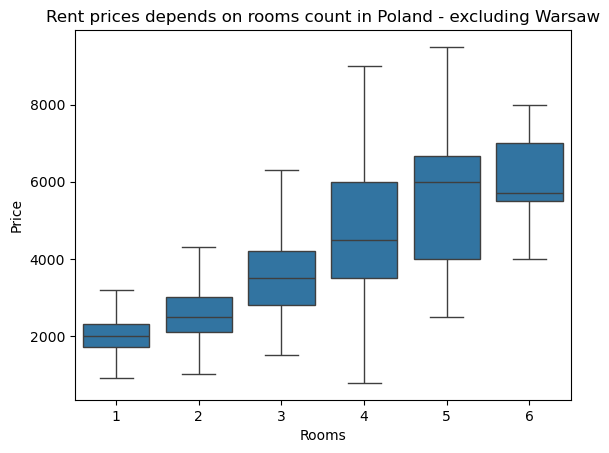

# Polish Apartment Rental Market Analysis

This project presents a comprehensive analysis of the apartment rental market across 15 major cities in Poland, with a particular focus on comparing Warsaw to the rest of the country. The dataset includes detailed property attributes, geographic coordinates, proximity to amenities, and rental prices.

## Dataset Overview

The dataset `apartments_rent_pl_2024_06.csv` contains **8,849 records** and **28 features**, including:

- `city`, `type`, `squareMeters`, `rooms`, `floor`, `buildYear`
- Proximity to amenities: `schoolDistance`, `clinicDistance`, `restaurantDistance`, etc.
- Binary features: `hasBalcony`, `hasElevator`, `hasParkingSpace`, etc.
- Target variable: `price` (monthly rent in PLN)

## Data Cleaning & Preprocessing

- Removed columns with excessive missing values: `buildingMaterial`, `condition`
- Imputed missing values using **KNNImputer**
- Encoded categorical variables using **LabelEncoder**
- Final dataset (`df_imputed`) contains **cleaned and imputed data** ready for analysis

## Exploratory Data Analysis

### Rent Prices by Room Count (Excluding Warsaw)

### Rent Prices by Property Type

### Apartment Size by Property Type

### Price Distribution (Excluding Warsaw)

## Predictive Modeling

Built a **Linear Regression** model to predict rental prices based on:

- `squareMeters`, `rooms`, `buildYear`, `centreDistance`, `floor`, `poiCount`

### Model Performance

- **R² score**: 0.56
- **RMSE**: ~766 PLN

### Actual vs Predicted Prices

### Feature Impact on Price

### Residuals Distribution

## Warsaw vs Other Cities

| Metric        | Warsaw         | Other Cities    |
|---------------|----------------|-----------------|
| Mean Price    | 5,194 PLN      | 2,898 PLN       |
| Mean Size     | 61.98 m²       | 49.94 m²        |
| Max Price     | 19,500 PLN     | 9,500 PLN       |

## Interactive Dashboard

I also created an interactive dashboard in Tableau based on this analysis:

[View the Tableau Dashboard](https://public.tableau.com/app/profile/jakub.ko.paczy.ski/viz/ApartmentRentalMarket/Dashboard1)

## Contact
Author: Jakub Kołpczyński  GitHub: [(https://github.com/jakubkolpaczynski]
